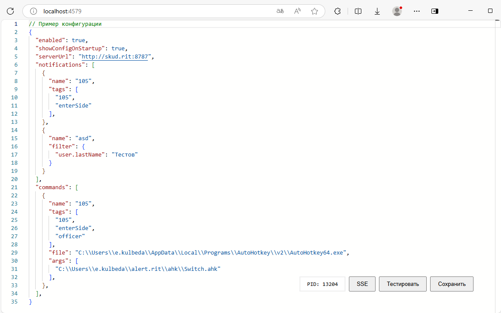
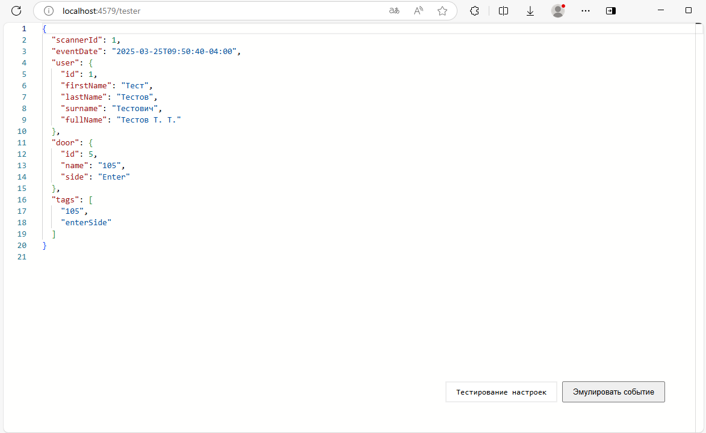

# RIT.Alert Client

Программа для выполнения команд или отправки уведомлений при событиях с
RIT.Alert Server.

## Установка

Скачайте исполняемый файл со
[страницы релизов](https://github.com/k257588376/rit-alert-client/releases).

## Запуск

Доступные аргументы при запуске:

- `--log-file` включить запись логов в файл с ротацией в working directory
- `--debug` изменить уровень логирования на debug

## Конфигурация

После запуска приложения, перейдите на http://localhost:4579/ . По этому адресу
можно редактировать файл конфигурации в формате JSONC (JSON with Comments) прямо
из браузера. Данный файл храниться по адресу
`<домашняя директория>/ritalert.jsonc`. При изменении вручную програму следует
перезапустить.



- Сочетание клавиш для комментирования выделения: Сtrl+/.
- Чтобы сохранить конфигурацию: Ctrl+S.
- Чтобы открыть список возможных полей: Ctrl+Space

#### Фильтры

Уведомления и команды имеют возможность фильтровать события, для которых
необходимо выполнить действие.

- `tags` - массив тегов, которые должны содержаться в событии, чтобы выполнить
  действие (быстро)
- `filter` - MongoDB-like фильтр, синтаксис смотрите
  [здесь](https://www.mongodb.com/docs/manual/tutorial/query-documents/)
  (медленее)

Чтобы протестировать конфигурацию, не дожидаясь события, перейдите на страницу
тестирования по кнопке "Тестировать". Нажмите "Эмулировать событие", чтобы
программа выполнила необходимые действия для этого тестового события.



### Примеры конфигураций

#### Windows

```jsonc
{
  "enabled": true,
  "serverUrl": "http://skud.rit:8787",
  "notifications": [
    // Показывать уведомление, если выполняется одно из:
    {
      "name": "105",
      // если в событии присутствуют теги:
      "tags": ["105", "enterSide"]
    },
    {
      "name": "example1",
      // если MongoDB-like фильтр выполняется:
      "filter": {
        "user.lastName": "Тестов"
      }
    },
    {
      "name": "example2",
      // Условия можно совмещать, результат - логическое И между ними.
      // Различие в том, что скорость сравнения тегов выше, чем выполнение фильтра
      "tags": ["entrance", "enterSide"],
      "filter": {
        "user.lastName": "Казаровец"
      }
    }
  ],
  "commands": [
    // Вызывать команды, если выполняется одно из:
    {
      "name": "105",
      "tags": ["105", "enterSide", "officer"],
      // Путь к исполняемому файлу. Замените %LocalAppData% полным путем
      "file": "%LocalAppData%\\Programs\\AutoHotkey\\v2\\AutoHotkey64.exe",
      // Аргументы для исполняемого файла
      "args": ["<путь к проекту>\\ahk\\Switch.ahk"]
    }
  ]
}
```

Пример скрипта AutoHotkey для переключения окон лежит в папке
[ahk](https://github.com/k257588376/rit-alert-client/tree/main/ahk) репозитория.

#### Linux, X11

[wmctrl](https://linux.die.net/man/1/wmctrl) - это команда, которая используется
для взаимодействия с X Window Manager, который совместим со спецификацией
EWMH/NetWM.

```bash
sudo apt-get install wmctrl
```

```jsonc
{
  "enabled": true,
  "serverUrl": "http://skud.rit:8787",
  "notifications": [/*...*/],
  "commands": [
    {
      "name": "105",
      "tags": ["105", "enterSide", "officer"],
      "file": "wmctrl",
      "args": ["-a", "Visual Studio Code"]
    }
  ]
}
```

### Другие настройки

- `showConfigOnStartup` - показывать уведомление с конфигурацией программы при
  запуске
- `windowsIsScreenLockedCheckInterval` - интервал в миллисекундах вызова функции
  проверки, заблокирован ли экран на Windows.

### Другие эндпоинты

- GET http://localhost:4579/tester - эмулировать событие для тестирования
- POST http://localhost:4579/config/enabled - включить/отключить программу
  отправив в теле запроса `true` или `false`

## Автозагрузка

### Windows

Скачайте файл
[start.ps1](https://github.com/k257588376/rit-alert-client/blob/main/start.ps1).
Разместите его в одной папке с исполняемым файлом.

Для доступа с оконному менеджеру программу следует запускать от имени текущего
пользователя

1. Введите в проводнике путь: `shell:startup`, нажмите Enter (или перейдите
   вручную в папку
   `%AppData%/Microsoft/Windows/Главное меню/Программы/Автозагрузка`)
2. Создайте ярлык к
   `"C:\Program Files\PowerShell\7\pwsh.exe" "<путь к проекту>\start.ps1"`

Вывод программы можно увидеть в файле `output.log` в папке с файлом.

Завершить процесс можно через Диспетчер задач по PID процесса, который можно
найти в логах, или по поиску 'rit-alert.exe'.

### Linux

1. Скопируйте исполняемый файл для Linux в `/usr/local/bin/rit-alert`

```bash
sudo mv rit-alert /usr/local/bin/
sudo chmod +x /usr/local/bin/rit-alert
```

2. Создайте файл `~/.config/systemd/user/rit-alert.service` со следующим
   содержимым:

```ini
[Unit]
Description=RIT.Alert Client Service
Wants=network-online.target
After=network-online.target
After=graphical-session.target
BindsTo=graphical-session.target
PartOf=graphical-session.target
Requisite=graphical-session.target
ConditionEnvironment=DISPLAY
ConditionEnvironment=XAUTHORITY

[Service]
Type=simple
StandardOutput=journal
ExecStart=/usr/local/bin/rit-alert

[Install]
WantedBy=graphical-session.target
```

3. Включите сервис:

```bash
systemctl --user enable rit-alert
```

## Отключение / включение по сочетанию клавиш

### Windows

Пример интеграции с AutoHotKey для отключения / включения по сочетанию клавиш
глобально

```ahk
EditConfig(value) {
  ; https://learn.microsoft.com/en-us/windows/win32/winhttp/winhttprequest
  web := ComObject('WinHttp.WinHttpRequest.5.1')
  web.Open('POST', 'http://localhost:4579/config/enabled')
  web.Send(value)
  web.WaitForResponse()
  if web.Status != 200 {
      MsgBox web.ResponseText
      return
  }  

  if value == 'true' {
      MsgBox 'Enabled', 'Config', "OK T1"
  }
  else {
      MsgBox 'Disabled', 'Config', "OK T1"
  }
}


!^+Z::EditConfig('false')
!^+X::EditConfig('true')
```

- Приостановить прослуживание событий: Ctrl+Shift+Alt+Z
- Возобновить прослуживание событий: Ctrl+Shift+Alt+X

При нажатии будет появляться окно-подтверждение выполненого действия, которое
исчезает через секунду.

### Linux

Используйте
[встроенные возможности вашей оболочки](https://help.ubuntu.com/stable/ubuntu-help/keyboard-shortcuts-set.html.en#:~:text=Windows-,Custom%20shortcuts,-To%20create%20your)
чтобы запускать команду `curl` по сочетанию клавиш.

```bash
curl -X POST 'http://localhost:4579/config/enabled' \
  --header 'Content-Type: text/plain' \
  --data-raw 'true'
```

true - включает, false - выключает соответственно

## Contribution

Проект родился с мыслью "А что если попробовать использовать реактивность Vue на
сервере в Node.js?". Ответ содержится в исходном коде, начиная с
[`src/index.ts`](https://github.com/k257588376/rit-alert-client/blob/main/src/index.ts)

Примечания:

- Программа работает для только одного пользователя в системе! При переключении
  между пользователями, если сессия другого пользователя все еще активна,
  программа выдаст ошибку при попытке слушать порт 4579, так как он уже занят.
- Так как в Windows нет команды, которая красиво показывает Toast Notification с
  приемлемой скоростью, пришлось написать PowerShell скрипт, который читает
  stdin и отправляет его с использованием user32.dll
- Чтобы не отправлять сообщения, когда пользователь заблокировал экран или
  сменил учетную запись, был написан хук для отслеживания подобного состояния.
  При этих условиях подписка на события останавливается. Так как нельзя
  подписаться на состояние заблокированного экрана, программа с определенным
  интервалом чекает его.
- Чтобы отредактировать конфигурацию через браузер, необходим интернет для
  загрузки редактора (подключение к [esm.sh](https://esm.sh/))
- Проект мигрировал с Node.js на Deno, чтобы иметь возможность сделать single
  executable file.
